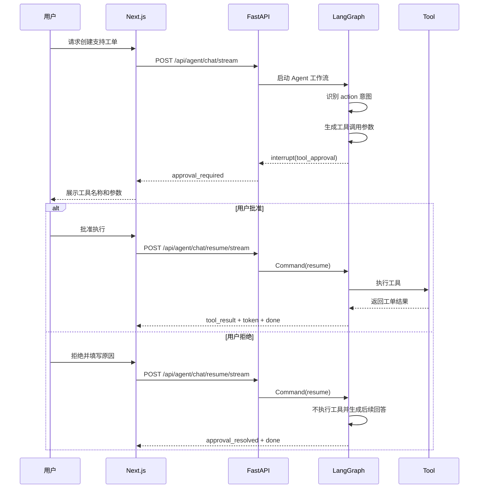
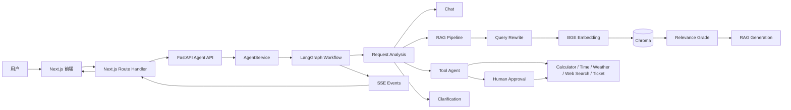
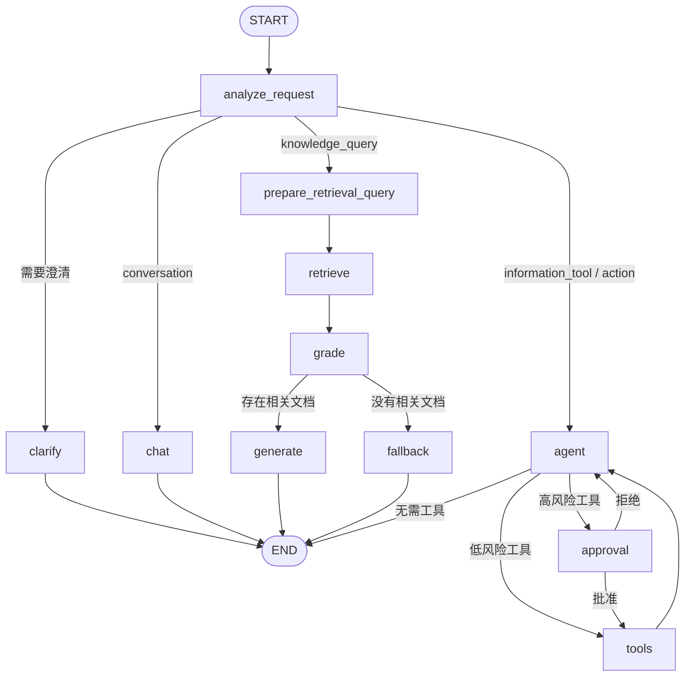

# AI Agent Backend

一个面向 AI 应用开发岗位的全栈 Agent 演示项目。

项目使用 FastAPI、LangGraph、Chroma 和本地 BGE Embedding 构建 Agent 后端，并提供 Next.js 前端，用于展示结构化意图分析、RAG、工具调用、SSE 流式输出、执行轨迹和 Human-in-the-loop 人工审批。

## 项目定位

传统聊天接口通常只有：

```text
用户问题 → LLM → 文本回答
```

本项目实现了一条可观察、可中断、可恢复的 Agent 工作流：

```text
用户请求
→ 结构化意图分析
→ 工作流路由
→ 普通对话 / RAG / 工具 Agent
→ SSE 执行事件
→ 前端实时展示
```

对于创建工单等可能产生外部副作用的操作，工作流会在工具执行前暂停，等待用户批准或拒绝，再从 LangGraph checkpoint 恢复执行。

## 在线能力概览

### 结构化请求分析

Router 不只返回简单路由，还会生成结构化分析结果：

```json
{
  "intent": "knowledge_query",
  "route": "rag",
  "needs_knowledge": true,
  "needs_tools": false,
  "requires_clarification": false,
  "rewritten_query": "AI Agent Backend 如何实现工具调用前的人工审批？",
  "clarification_question": null,
  "reason": "用户的问题需要查询项目知识库"
}
```

当前支持四种意图：

| 意图 | 说明 | 默认路由 |
|---|---|---|
| `conversation` | 普通交流、问候和解释 | `chat` |
| `knowledge_query` | 私有知识库查询 | `rag` |
| `information_tool` | 天气、时间、计算等只读工具 | `agent` |
| `action` | 创建工单等有副作用的操作 | `agent` |

当任务缺少必要参数时，工作流会先进入 `clarify` 节点向用户提问，而不是猜测参数或直接执行。

### 显式 Embedding 与 RAG

项目使用本地模型：

```text
BAAI/bge-small-zh-v1.5
```

实际检索链路为：

```text
PDF / 文本
→ 文档解析
→ OCR 回退
→ 文本分块
→ 默认 BGE 模型批量生成 512 维归一化向量
→ 显式写入 Chroma
→ 查询向量化
→ cosine 相似度检索
→ 相关性过滤
→ 带引用回答
```

Embedding 不由 Chroma 隐式生成。入库和查询统一经过 `EmbeddingService`，保证模型、向量维度和相似度语义一致；每个 Chroma 集合还会记录 Embedding 模型名称，配置不一致时拒绝查询并提示重新导入。

RAG 执行轨迹会展示：

- Router 改写后的独立检索问题
- 召回文档数量
- 文档来源和 PDF 页码
- cosine 相似度
- 过滤前后文档数量
- 最终引用来源

### 工具调用

当前内置工具包括：

| 工具 | 类型 | 是否需要审批 |
|---|---|---:|
| Calculator | 数学计算 | 否 |
| Time | 时间查询 | 否 |
| Weather | 天气查询 | 否 |
| Web Search | Tavily 联网搜索，最多返回 5 条结果 | 否 |
| Create Support Ticket | 创建模拟支持工单 | 是 |

只读工具可以直接执行。天气查询仅在调用时需要 `OPENWEATHER_API_KEY`，联网搜索仅在调用时需要 `TAVILY_API_KEY`。

创建工单属于有副作用的业务操作，必须经过人工审批。

### Human-in-the-loop

高风险工具调用流程：



工作流使用 `session_id` 作为 LangGraph `thread_id`。第一次 SSE 连接在 `interrupt()` 时结束，用户做出决定后通过第二次请求恢复同一条工作流。

### SSE 流式执行事件

后端不仅流式返回回答 token，还会输出 Agent 执行事件：

```text
start
analysis
route
retrieval
retrieval_graded
tool_call
approval_required
approval_resolved
tool_result
search_results
citations
token
done
error
```

用户在前端主动停止生成时，前端还会在本地记录 `stopped` 事件；它不是后端发送的 SSE 事件。

前端通过原生 `fetch + ReadableStream` 解析 SSE，不依赖额外流式请求库。

Next.js Route Handler 直接转发 FastAPI 响应体，并关闭代理缓存和缓冲，保证 token 能够实时显示。

## 系统架构



## LangGraph 工作流



## 前端界面

前端使用 Next.js、TypeScript、Tailwind CSS 和 shadcn/ui，当前支持：

- Chat、RAG、Agent 和自动路由模式
- 真正的逐 token 流式回答
- 知识库列表、选择和 PDF 导入
- 引用来源和相似度展示
- Agent 请求分析
- 路由原因
- RAG 召回和过滤轨迹
- 工具调用参数
- 联网搜索结果及来源链接
- 人工审批卡片
- 批准或拒绝后恢复执行
- 主动停止生成和清空当前页面对话
- Agent 完整事件轨迹
- 可配置的 HTTP Basic Auth 演示站点访问保护

## 技术栈

### Backend

- Python 3.13
- FastAPI
- LangGraph
- LangChain
- Pydantic
- OpenAI-compatible Chat API
- httpx
- Sentence Transformers
- BAAI/bge-small-zh-v1.5
- Chroma
- PyPDF
- PyMuPDF
- RapidOCR

### Frontend

- Next.js 16
- React 19
- TypeScript
- Tailwind CSS
- shadcn/ui
- Lucide Icons
- 原生 `fetch + ReadableStream`

### Engineering

- pytest
- MyPy
- Black
- flake8
- GitHub Actions
- Docker
- Docker Compose

## 项目结构

```text
.
├── app
│   ├── adapters            # OpenAI 与领域消息/工具适配
│   ├── api                 # FastAPI 路由
│   ├── core                # 配置、日志和生命周期
│   ├── domain              # 领域类型
│   ├── graph               # LangGraph State、Node 和 Workflow
│   ├── models              # 模型结构化输出
│   ├── prompts             # Router、Agent 和 RAG 提示词
│   ├── rag                 # PDF、OCR、Chunk、Embedding 和 Chroma
│   ├── repositories        # 内存会话仓储
│   ├── schemas             # API 请求与响应模型
│   ├── services            # Agent、RAG、Chat 和 Tool 服务
│   ├── tools               # Calculator、Time、Weather、Web Search 和 Ticket
│   └── utils               # SSE 等通用工具
├── frontend
│   └── src
│       ├── app             # Next.js App Router
│       ├── components      # 聊天、轨迹、审批和知识库 UI
│       ├── hooks           # Agent 聊天状态
│       ├── lib             # SSE 与 RAG 请求
│       └── types           # TypeScript 协议类型
├── scripts                 # 环境初始化和统一检查
├── tests                   # 后端自动测试
├── Dockerfile
├── docker-compose.yml
├── main.py
└── pyproject.toml
```

## 环境要求

- Python 3.13
- Node.js 20 或更高版本
- Git
- OpenAI-compatible Chat API 密钥
- Docker Desktop，可选

本地 BGE 模型首次运行时需要从 Hugging Face 下载。

## 快速启动

### 1. 克隆项目

```bash
git clone https://github.com/claercc/agent-weave.git
cd agent-weave
```

### 2. 初始化 Python 环境

Windows：

```powershell
python scripts\bootstrap.py
```

也可以手动安装：

```powershell
python -m venv .venv
.\.venv\Scripts\python.exe -m pip install --upgrade pip
.\.venv\Scripts\python.exe -m pip install --editable ".[dev]"
```

Linux 或 macOS：

```bash
python scripts/bootstrap.py
```

### 3. 配置环境变量

复制示例文件：

```powershell
Copy-Item .env.example .env
```

至少填写模型服务配置：

```dotenv
OPENAI_API_KEY=你的模型服务密钥
OPENAI_BASE_URL=https://api.deepseek.com
MODEL_NAME=你的聊天模型名称
MODEL_REQUEST_TIMEOUT_SECONDS=30
MODEL_MAX_RETRIES=2
```

其他主要配置：

| 环境变量 | 是否必需 | 说明 |
|---|---:|---|
| `EMBEDDING_MODEL` | 否 | 本地 Embedding 模型，默认 `BAAI/bge-small-zh-v1.5` |
| `OPENWEATHER_API_KEY` | 按需 | 调用天气工具时需要 |
| `TAVILY_API_KEY` | 按需 | 调用联网搜索工具时需要 |
| `DEMO_USERNAME` / `DEMO_PASSWORD` | 前端需要 | Next.js 演示站点的 HTTP Basic Auth 凭据 |
| `FRONTEND_BIND_ADDRESS` / `FRONTEND_PORT` | 否 | Compose 前端监听地址和端口 |
| `BACKEND_BIND_ADDRESS` / `BACKEND_PORT` | 否 | Compose 后端监听地址和端口 |

本地直接运行后端时，BGE 模型会在首次使用 RAG 时下载。Docker 镜像则在构建阶段下载模型，并在运行阶段启用离线模式。

### 4. 启动后端

Windows：

```powershell
.\.venv\Scripts\python.exe main.py
```

Linux 或 macOS：

```bash
./.venv/bin/python main.py
```

验证服务：

```bash
curl http://127.0.0.1:8000/api/health/ready
```

API 文档位于 `http://127.0.0.1:8000/docs`。

### 5. 启动前端

```bash
cd frontend
cp .env.example .env.local
npm ci
npm run dev
```

Windows PowerShell 可使用：

```powershell
cd frontend
Copy-Item .env.example .env.local
npm.cmd ci
npm.cmd run dev
```

启动前还需要在 `frontend/.env.local` 中设置演示站点凭据：

```dotenv
BACKEND_BASE_URL=http://127.0.0.1:8000
DEMO_USERNAME=demo
DEMO_PASSWORD=请设置一个非空密码
```

浏览器访问 `http://127.0.0.1:3000` 并输入上述凭据。如果后端不在本机，修改 `BACKEND_BASE_URL`。未配置用户名或密码时，前端会返回 `503`。

### Docker Compose 启动

```bash
docker compose up --build
```

Compose 会同时启动后端和前端，并管理 Chroma 数据卷和模型缓存。启动前必须在根目录 `.env` 中设置非空的 `DEMO_USERNAME` 和 `DEMO_PASSWORD`。

如果没有覆盖端口变量，Compose 默认访问地址为：

- 前端：`http://127.0.0.1:3000`
- 后端：`http://127.0.0.1:8000`
- API 文档：`http://127.0.0.1:8000/docs`

仓库提供的 `.env.example` 面向公网演示，预设前端端口为 `8080`、后端端口为 `8081`，并只把后端绑定到 `127.0.0.1`。复制该文件后，应分别访问 `http://127.0.0.1:8080` 和 `http://127.0.0.1:8081/docs`。

## API 示例

核心接口：

| 方法 | 路径 | 说明 |
|---|---|---|
| `GET` | `/api/health/live` | 进程存活检查 |
| `GET` | `/api/health/ready` | Agent 与 RAG 服务就绪检查 |
| `POST` | `/api/agent/chat` | 非流式统一 Agent 请求 |
| `POST` | `/api/agent/chat/stream` | SSE 统一 Agent 请求 |
| `POST` | `/api/agent/chat/resume/stream` | 提交审批结果并恢复工作流 |
| `GET` | `/api/rag/collections` | 列出知识库 |
| `DELETE` | `/api/rag/collections/{collection_name}` | 删除知识库 |
| `POST` | `/api/rag/ingest` | 导入文本列表 |
| `POST` | `/api/rag/ingest/pdf` | 上传并导入 PDF |
| `POST` | `/api/rag/query` | 使用指定知识库完成传统非流式 RAG 查询 |

`/api/chat`、`/api/chat/stream` 和 `/api/chat/tools` 是早期聊天接口；新功能应优先使用 `/api/agent/*`。

普通 Agent 请求：

```bash
curl -X POST http://127.0.0.1:8000/api/agent/chat \
  -H "Content-Type: application/json" \
  -d '{"session_id":"demo-1","message":"现在几点？","mode":"auto"}'
```

SSE 流式请求：

```bash
curl -N -X POST http://127.0.0.1:8000/api/agent/chat/stream \
  -H "Content-Type: application/json" \
  -d '{"session_id":"demo-1","message":"介绍一下这个项目","mode":"chat"}'
```

RAG 流式请求：

```bash
curl -N -X POST http://127.0.0.1:8000/api/agent/chat/stream \
  -H "Content-Type: application/json" \
  -d '{"session_id":"demo-1","message":"这个项目如何处理工具审批？","mode":"rag","collection_name":"project-docs"}'
```

PDF 上传：

```bash
curl -X POST http://127.0.0.1:8000/api/rag/ingest/pdf \
  -F "file=@README.pdf;type=application/pdf" \
  -F "collection_name=project-docs"
```

PDF 限制为 10 MB、100 页，并校验扩展名和文件签名；纯图片页面会回退到本地 RapidOCR。查询或删除不存在的知识库会返回 `404`。

## 质量检查

后端：

```powershell
.\.venv\Scripts\python.exe scripts\check.py
```

Linux 或 macOS 使用 `./.venv/bin/python scripts/check.py`。统一脚本依次执行 Black 格式检查、flake8、MyPy 和 pytest。

前端：

```bash
cd frontend
npm run lint
npx tsc --noEmit
npm run build
```

GitHub Actions 会同时运行前后端检查。

## 已知限制

- LangGraph 当前使用内存 checkpoint，服务重启后会话和待审批状态不会保留。
- 前端只有面向演示环境的 HTTP Basic Auth；后端 API 本身没有认证和授权，不应直接暴露到公网。
- 支持工单保存在当前进程内存中，不是持久化工单系统。
- Compose 面向单机演示；生产部署仍需要 HTTPS、密钥管理、认证授权、限流和可观察性。
- 本地 BGE、OCR 和 Chroma 更适合单机演示；多实例部署需要独立模型服务和持久化数据库。
